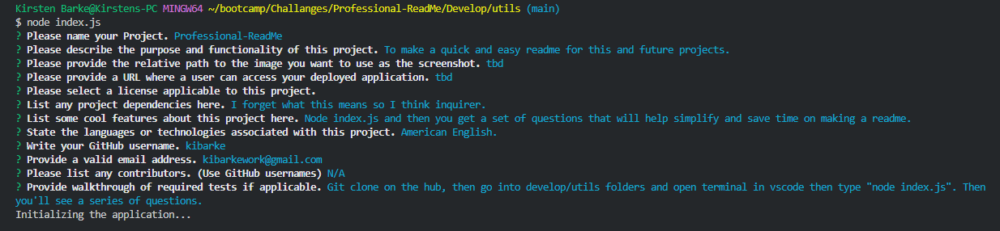

# Professional-ReadMe

## Description

To make a quick and easy readme for this and future projects.

## Table of Contents

- [Installation](#installation)
- [Deployed-Application-URL] (#deployed)
- [Usage](#usage)
- [Tests](#tests)
- [Contributors](#contributors)
- [Screenshot](#screenshot)
- [Questions](#questions)
[License](#license)

## Installation

undefined

## Deployed Application URL

[Deployed-Link](https://kibarke.github.io/Professional-ReadMe/)

## Usage

American English.

## Tests

undefined

## Contributors

N/A

## Screenshot

## Questions

For questions about the project, you can reach me at [kibarkework@gmail.com](mailto:kibarkework@gmail.com).

## License

This project is licensed under the [ License](https://opensource.org/licenses/).
